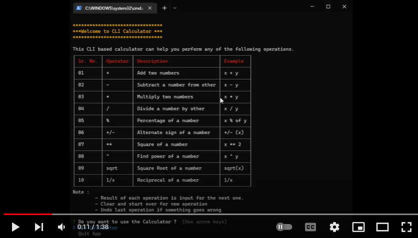

# Command Line Calculator (TS)

A CLI based calculator using typescript and published as an executable npm package, complete problem statement is available [here](https://github.com/panaverse/typescript-node-projects/tree/main/project00_calculator).

## NPM Package

### Usage

This project is published as an [npm package](https://www.npmjs.com/package/wmd-ts-calculator). To use follow these steps.

- Install as an npm package

```cmd
npm install wmd-ts-calculator
```

- Run the app after installation

```cmd
wmd-ts-calculator
```

- Use the app as an npx package

```cmd
npx wmd-ts-calculator
```

### Instructions

This CLI based calculator can help you perform any of the following operations.

| Sr. No. | Operator | Description                  | Example  |
| ------- | -------- | ---------------------------- | -------- |
| 01      | +        | Add two numbers              | x + y    |
| 02      | -        | Subtract a number from other | x - y    |
| 03      | \*       | Multiply two numbers         | x \* y   |
| 04      | /        | Divide a number by other     | x / y    |
| 05      | %        | Percentage of a number       | x % of y |
| 06      | +/-      | Alternate sign of a number   | +/- (x)  |
| 07      | \*\*     | Square of a number           | x \*\* 2 |
| 08      | ^        | Find power of a number       | x ^ y    |
| 09      | sqrt     | Square Root of a number      | sqrt(x)  |
| 10      | 1/x      | Reciprocal of a number       | 1/x      |

**Note :**

- Result of each operation is input for the next one.
- Clear and start over for new operation
- Undo last operation if something goes wrong

## Demo

[](https://youtu.be/zSN2G2QyPlE 'CLI Calculator')

## Steps to code CLI calculator

All the details to code this app is given [here](https://github.com/hassan-ak/wmd-ts-calculator/blob/main/stepsToCode/Readme.md).
